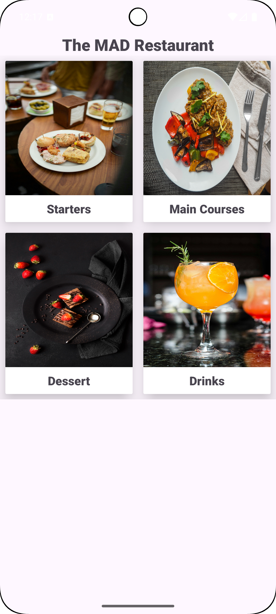
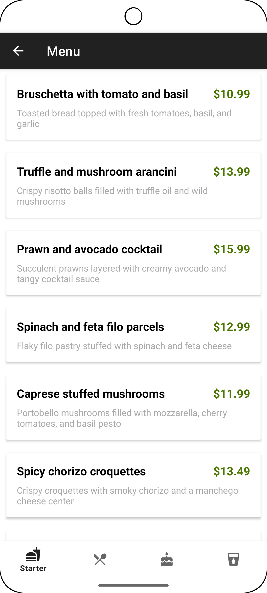
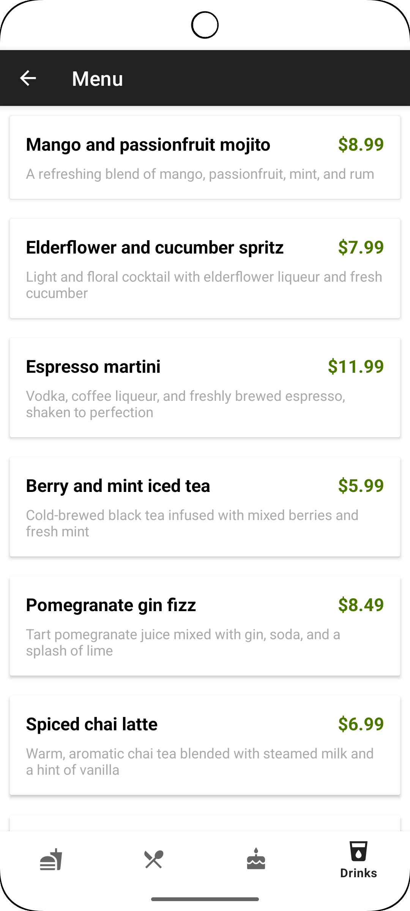
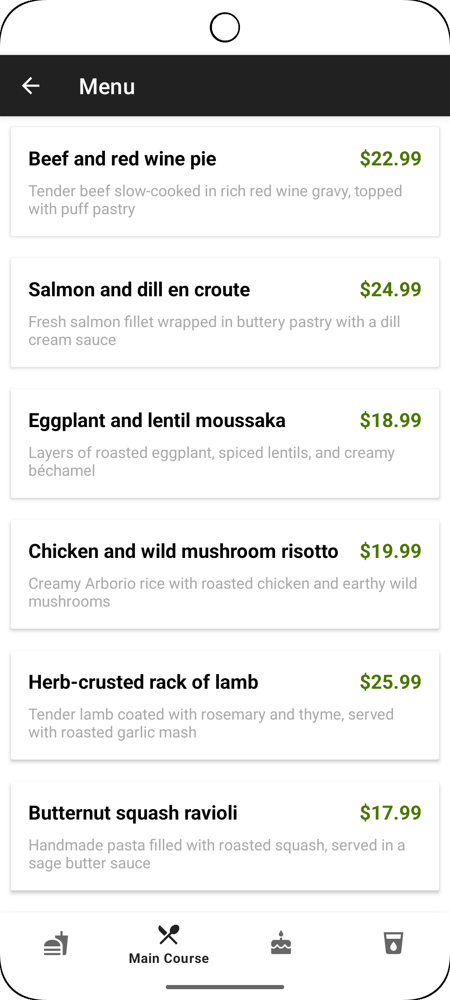
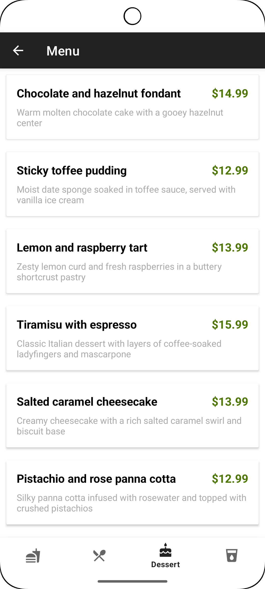

# Restaurant Menu App (Android + Room Database)

This Android application showcases a clean and efficient way to render a restaurant menu. Developed in Java and structured with Fragments, it demonstrates modular UI design, reusable components, and a straightforward user experience suitable for small restaurant apps or menu‑display systems.
---

## 🍲 Features

- Fragment‑based navigation for a modular and maintainable UI
- Menu categories displayed using RecyclerView
- Dish details screen with image, description, and price
- Static data rendering for demonstration purposes
- Lightweight, beginner‑friendly architecture
---

## 🛠️ Tech Stack

| Component        | Technology                                  |
|------------------|---------------------------------------------|
| Language         | Java                                        |
| UI Architecture  | Fragments                                   |
| UI Components    | RecyclerView, CardView, ImageView, TextView |
| Build System     | Gradle                                      |
| IDE              | Android Studio                              |

---
## 📱 App Screenshots

### Onboarding & Home

<table>
  <tr>
    <td></td>
  </tr>
</table>

### Menu List

<table>
  <tr>
    <td></td>
    <td></td>
    <td></td>
    <td></td>
  </tr>
</table>

## Purpose of the Project
This project serves as a clean example of:

1. Basic Android UI development
2. Fragment navigation
3. RecyclerView usage
4. Passing data between fragments
5. Structuring a small Android app

## 👤 Developer

**Emmanuel Oyenuga**  
Mobile App Developer – Winnipeg, MB  
